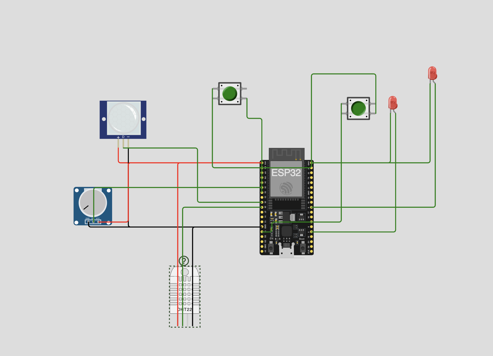
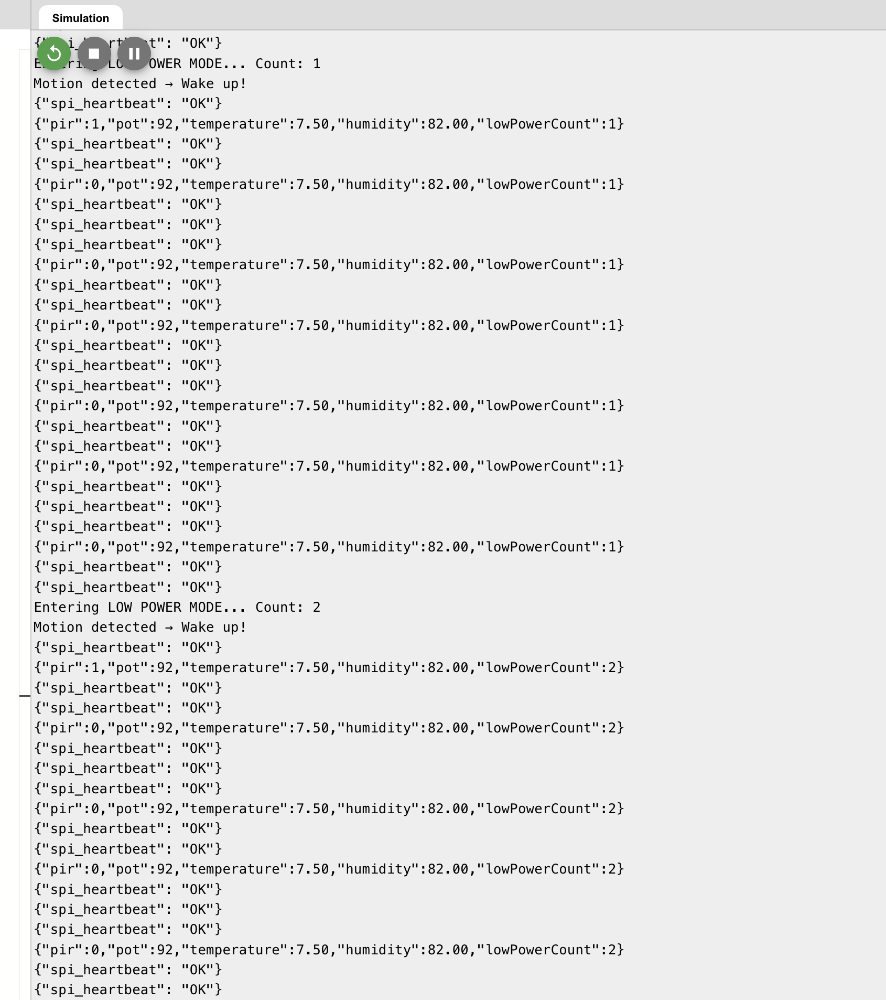
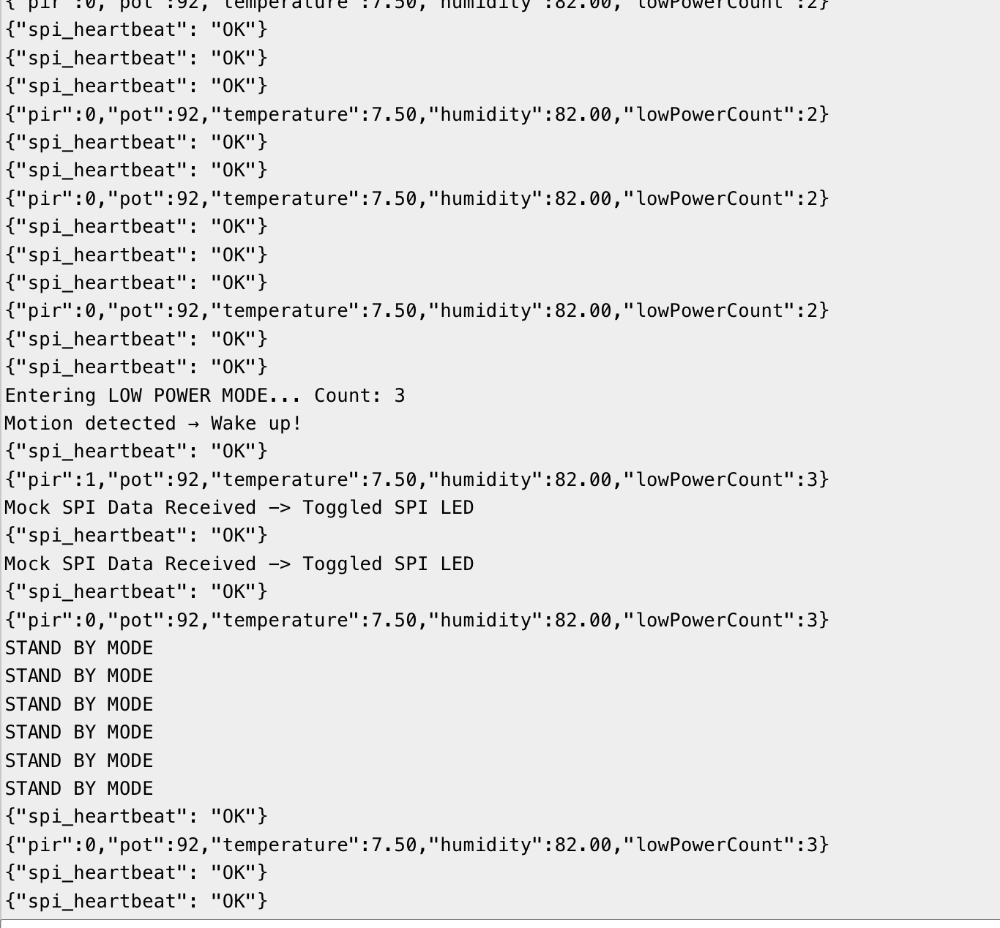
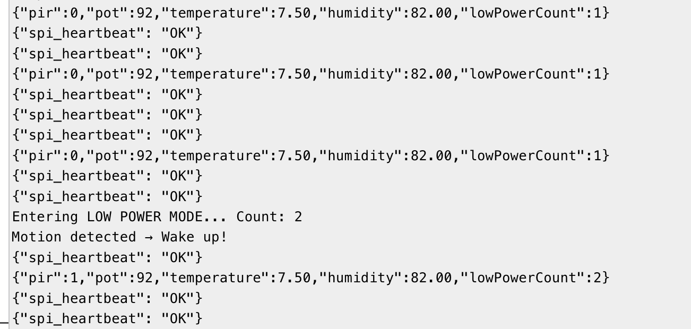

# ESP32 Sensor & Low Power System Simulation

## 📌 Project Overview
This project demonstrates an **ESP32-based system** in Wokwi that:
- Reads data from a **DHT22 sensor**.
- Sends readings over **UART (Serial Monitor)** every 5 seconds in JSON format.
- Handles **external interrupts** via a button to toggle between **Active** and **Standby** modes.
- Supports a **Sleep mode** triggered by inactivity.
- Includes an **EEPROM counter** that tracks the number of wakeups.

---

## 🔧 Hardware Connections (Wokwi Simulation)

| Component   | ESP32 Pin |
|-------------|-----------|
| DHT22 Data  | GPIO 15   |
| PIR Sensor  | GPIO 27   |
| Button      | GPIO 14   |
| LED         | GPIO 2 (Onboard LED) |

---

## ⚡ Pin Mappings

- **DHT22** → GPIO 15  
- **PIR Sensor** → GPIO 27 (interrupt source)  
- **Button** → GPIO 14 (external interrupt for Active/Standby)  
- **LED** → GPIO 2 (built-in LED toggle)  

---

## 🌀 System Modes

### 1. **Active Mode**
- Default startup mode.  
- Sends DHT22 readings every **5 seconds** over UART in JSON format.  
- LED blinks to indicate activity.  

### 2. **Standby Mode**
- Triggered by **button falling edge interrupt**.  
- UART output is paused.  
- LED stays OFF.  

### 3. **Resume Active**
- Triggered by **button rising edge interrupt**.  
- UART output resumes.  
- LED toggles back ON.  

### 4. **Sleep Mode**
- If no motion is detected by PIR for a set timeout (e.g., 30 seconds), the system enters **deep sleep**.  
- **Wakeup** happens when the PIR detects motion.  
- On wakeup:
  - EEPROM counter increments.  
  - System prints: `Wakeup #N → Motion detected`.  

---

## 📜 Low-Power Logic
- **Interrupt-driven** mode switching using button & PIR.  
- **Deep sleep** after inactivity → saves power.  
- **EEPROM counter** ensures wakeup history is persistent across resets.  

---

## ▶️ Running the Project

1. Open the project in **Wokwi**.  
2. Upload the code to ESP32.  
3. Open **Serial Monitor** at `115200 baud`.  
4. Observe:
   - JSON sensor readings in active mode.  
   - No output in standby mode.  
   - Wakeup logs with EEPROM counter after PIR triggers.  

---

## 📸 Screenshots

- **Active Mode (JSON UART Output)**  
  

- **Standby Mode (LED Off, No UART Output)**  
  

- **Wakeup Event (EEPROM Counter)**  
  

---

## 🔗 Wokwi Project Link
👉 [Click Here to Open Simulation](https://wokwi.com/projects/440147266917427201)

---

